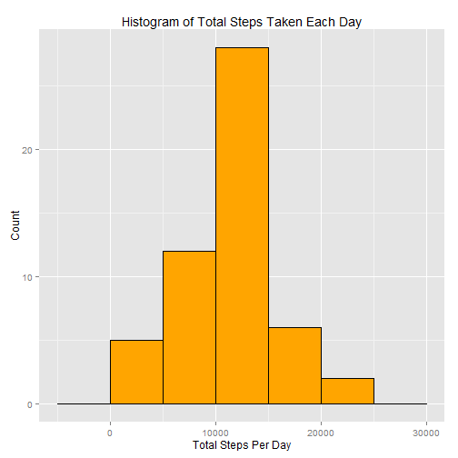
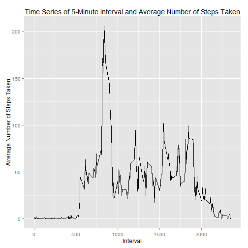
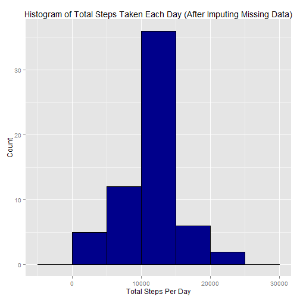
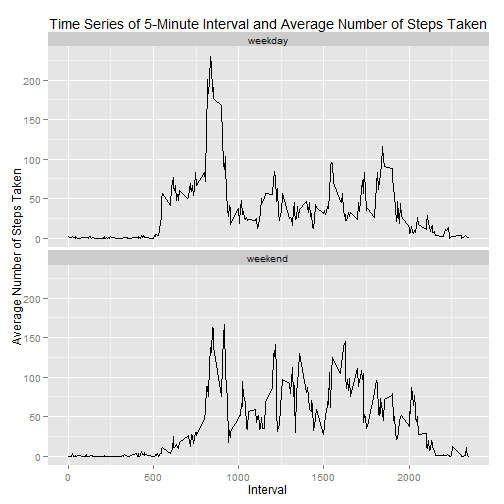

## Loading and preprocessing the data

- Load the data
- Process/transform the data (if necessary) into a format suitable for your analysis


```r
file <- read.csv(unz("activity.zip", "activity.csv"), header=TRUE, stringsAsFactors=FALSE, colClasses=c("integer", "Date", "integer"))
```


## What is mean total number of steps taken per day?

*Note: For this part of the assignment, missing values in the dataset are ignored.*


- Make a histogram of the total number of steps taken each day


```r
DailyTotalSteps <- aggregate(steps ~ date, data=file, sum)

library(ggplot2)

g1 <- ggplot(DailyTotalSteps, aes(steps)) +
  geom_histogram(binwidth=5000, color="black", fill="orange") +  
  labs(x="Total Steps Per Day") + labs(y="Count") + 
  labs(title="Histogram of Total Steps Taken Each Day")
print(g1)
```

 

- Calculate and report the mean and median total number of steps taken per day


```r
mean(DailyTotalSteps$steps)
```

```
## [1] 10766.19
```

```r
median(DailyTotalSteps$steps)
```

```
## [1] 10765
```


## What is the average daily activity pattern?

- Make a time series plot (i.e. type = "l") of the 5-minute interval (x-axis) and the average number of steps taken, averaged across all days (y-axis)


```r
IntAvgSteps <- aggregate(steps ~ interval, data=file, mean)

g2 <- ggplot(IntAvgSteps, aes(interval, steps)) +
  geom_line() +  
  labs(x="Interval") + labs(y="Average Number of Steps Taken") + 
  labs(title="Time Series of 5-Minute Interval and Average Number of Steps Taken")
print(g2)
```

 

- Which 5-minute interval, on average across all the days in the dataset, contains the maximum number of steps?


```r
MaxInterval <- IntAvgSteps[which.max(IntAvgSteps$steps),]
MaxInterval[,1]
```

```
## [1] 835
```


## Imputing missing values

*Note: There are a number of days/intervals where there are missing values (coded as NA). The presence of missing days may introduce bias into some calculations or summaries of the data.*


- Calculate and report the total number of missing values in the dataset (i.e. the total number of rows with NAs).


```r
OK <- complete.cases(file)
sum(!OK)
```

```
## [1] 2304
```


- Use the mean of 5-minute intervals for filling in all of the missing values in the dataset.
- Create a new dataset that is equal to the original dataset but with the missing data filled in.


```r
IntAvgSteps <- aggregate(steps ~ interval, data=file, mean)

newfile <- file

for (i in 1:nrow(newfile)) {
  if (is.na(newfile$steps[i])) { 
    temp <- newfile$interval[i]
    newfile$steps[i] <- IntAvgSteps[which(IntAvgSteps$interval==temp),2]
  }}
```


- Make a histogram of the total number of steps taken each day. 


```r
DailyTotalSteps2 <- aggregate(steps ~ date, data=newfile, sum)

g3 <- ggplot(DailyTotalSteps2, aes(steps)) +
  geom_histogram(binwidth=5000, color="black", fill="dark blue") +  
  labs(x="Total Steps Per Day") + labs(y="Count") + 
  labs(title="Histogram of Total Steps Taken Each Day (After Imputing Missing Data)")
print(g3)
```

 


- Calculate and report the mean and median total number of steps taken per day.


```r
mean(DailyTotalSteps2$steps)
```

```
## [1] 10766.19
```

```r
median(DailyTotalSteps2$steps)
```

```
## [1] 10766.19
```


Observations -- Depending on the method used to imput missing data, the results can be different.  The mean total number of steps taken per day plotted here is the same as the first part of the assignment (since missing data were imputed with the mean of 5-minute intervals).  However, the median total number of steps taken per day plotted here is now the same as the mean, and differs from the first part of the assignment.


## Are there differences in activity patterns between weekdays and weekends?

*The dataset with the filled-in missing values is used for this part.*

- Create a new factor variable in the dataset with two levels - "weekday" and "weekend" 


```r
newfile$day <- factor(weekdays(newfile$date))
levels(newfile$day)[levels(newfile$day) %in% c("Monday","Tuesday","Wednesday","Thursday","Friday")] <- "weekday"
levels(newfile$day)[levels(newfile$day) %in% c("Saturday","Sunday")] <- "weekend"
```

- Make a panel plot containing a time series plot (i.e. type = "l") of the 5-minute interval (x-axis) and the average number of steps taken, averaged across all weekday days or weekend days (y-axis). 


```r
IntAvgSteps2 <- aggregate(steps ~ interval + day, data=newfile, mean)

g4 <- ggplot(IntAvgSteps2, aes(interval, steps)) +
  geom_line() + facet_wrap(~day, ncol=1) +
  labs(x="Interval") + labs(y="Average Number of Steps Taken") + 
  labs(title="Time Series of 5-Minute Interval and Average Number of Steps Taken")
print(g4)
```

 

Observations -- Compared to weekdays, average number of steps taken per 5-minute interval is more evenly distributed.
